# 5 Steps to Service Mesh

This repository contains the terraform code that accompanies the session "[Service Mesh without Kubernetes](https://www.hashicorp.com/resources/service-mesh-without-kubernetes/)".

Please note, this is for Consul 1.7.3 and below, I’ll soon(ish) create a branch using Consul 1.8.0 (it’s magnificent but changes some things slightly).


## In a Nutshell
In a nutshell, these are the 5 steps that you need:

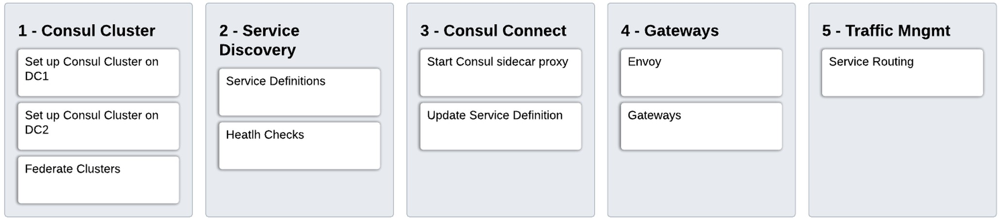


## included environment

In the [terraform/aws](./terraform/aws) directory there is code to spin up an environment with consul preconfigured. this takes a couple of minutes to get up and running correctly.

### Terraform Variables

```bash
# Module Configuration Variables
primary_region  = "eu-west-2"
secondary_region  = "eu-west-1"
owner   = "guybarros"
created-by = "Terraform CLI"
public_key = ""
clusterid = "guy-consul"
server_number = "3"
server_instance_type = "t2.medium"
worker_number = "3"
worker_instance_type = "t2.medium"
primary_datacenter = "dc1"
secondary_datacenter = "dc2"
# General Variables
consul_url = "https://releases.hashicorp.com/consul/1.7.2/consul_1.7.2_linux_amd64.zip"
vpc_cidr_block = "10.1.0.0/16"
cidr_blocks = ["10.1.1.0/24", "10.1.2.0/24"]
consul_join = "consul_join"
```
### Terraform Outputs

the Terraform code outputs what you need to run this session, including the URL to access the Consul UI and a facilitator to ssh into each of the boxes.
```bash
Apply complete! Resources: 36 added, 0 changed, 0 destroyed.

Outputs:

Primary_Servers_SSH = [
  "ssh -i ~/.ssh/id_rsa ubuntu@ec2-35-177-90-158.eu-west-2.compute.amazonaws.com",
  "ssh -i ~/.ssh/id_rsa ubuntu@ec2-35-176-85-58.eu-west-2.compute.amazonaws.com",
  "ssh -i ~/.ssh/id_rsa ubuntu@ec2-3-8-158-168.eu-west-2.compute.amazonaws.com",
]
Primary_Servers_UI = [
  "http://ec2-35-177-90-158.eu-west-2.compute.amazonaws.com:8500",
  "http://ec2-35-176-85-58.eu-west-2.compute.amazonaws.com:8500",
  "http://ec2-3-8-158-168.eu-west-2.compute.amazonaws.com:8500",
]
Primary_Workers_SSH = [
  "ssh -i ~/.ssh/id_rsa ubuntu@ec2-35-176-252-166.eu-west-2.compute.amazonaws.com",
  "ssh -i ~/.ssh/id_rsa ubuntu@ec2-35-179-92-203.eu-west-2.compute.amazonaws.com",
  "ssh -i ~/.ssh/id_rsa ubuntu@ec2-3-8-148-74.eu-west-2.compute.amazonaws.com",
]
Primary_Workers_UI = [
  "http://ec2-35-176-252-166.eu-west-2.compute.amazonaws.com:8500",
  "http://ec2-35-179-92-203.eu-west-2.compute.amazonaws.com:8500",
  "http://ec2-3-8-148-74.eu-west-2.compute.amazonaws.com:8500",
]
Secondary_Servers_SSH = [
  "ssh -i ~/.ssh/id_rsa ubuntu@ec2-35-178-171-146.eu-west-2.compute.amazonaws.com",
  "ssh -i ~/.ssh/id_rsa ubuntu@ec2-3-10-51-236.eu-west-2.compute.amazonaws.com",
  "ssh -i ~/.ssh/id_rsa ubuntu@ec2-35-177-242-138.eu-west-2.compute.amazonaws.com",
]
Secondary_Servers_UI = [
  "http://ec2-35-178-171-146.eu-west-2.compute.amazonaws.com:8500",
  "http://ec2-3-10-51-236.eu-west-2.compute.amazonaws.com:8500",
  "http://ec2-35-177-242-138.eu-west-2.compute.amazonaws.com:8500",
]
Secondary_Workers_SSH = [
  "ssh -i ~/.ssh/id_rsa ubuntu@ec2-3-8-77-88.eu-west-2.compute.amazonaws.com",
  "ssh -i ~/.ssh/id_rsa ubuntu@ec2-35-176-178-215.eu-west-2.compute.amazonaws.com",
  "ssh -i ~/.ssh/id_rsa ubuntu@ec2-18-130-84-185.eu-west-2.compute.amazonaws.com",
]
Secondary_Workers_UI = [
  "http://ec2-3-8-77-88.eu-west-2.compute.amazonaws.com:8500",
  "http://ec2-35-176-178-215.eu-west-2.compute.amazonaws.com:8500",
  "http://ec2-18-130-84-185.eu-west-2.compute.amazonaws.com:8500",
]
```

---

## Running the demo

### Pre requisites

There is a little bit of a set up that we need to be able to run this demo. namely, start Mongodb and start the Chat application.

#### MongoDB

SSH into any Primary Worker node, Install, Configure and Run Mongodb

```bash

ssh -i ~/.ssh/id_rsa ubuntu@ec2-35-176-252-166.eu-west-2.compute.amazonaws.com

ubuntu@guy-consul-0663-wkr-0:~$ sudo apt install mongodb-server

ubuntu@guy-consul-0663-wkr-0:~$ sudo sed -i 's/127.0.0.1/0.0.0.0/g' /etc/mongodb.conf

ubuntu@guy-consul-0663-wkr-0:~$ sudo systemctl restart mongodb

```
thats it. we'll set up the Chat application after we configure MongoDB in Consul so we can use the Service Discovery features of Consul.

---

## Step 1 - Consul Clusters

The set up for the consul cluster itself and ensuring that every node already has a Consul agent is done by the terraform code. you can look at the start up scripts that do this [here](./terraform/aws/modules/templates).

We do however need to federate DC2 to DC1. to do this, ssh into any Server node and run the following command:


```bash
ssh -i ~/.ssh/id_rsa ubuntu@ec2-35-177-90-158.eu-west-2.compute.amazonaws.com
ubuntu@guy-consul-0663-svr-0:~$ consul join -wan <ANY_SECONDARY_SERVER_ADDRESS>
Successfully joined cluster by contacting 1 nodes.
ubuntu@guy-consul-0663-svr-0:~$ consul members -wan list
Node                                 Address              Status  Type    Build  Protocol  DC             Segment
guy-consul-0663-svr-0.dc1-eu-west-2  35.177.90.158:8302   alive   server  1.7.2  2         dc1-eu-west-2  <all>
guy-consul-0663-svr-1.dc1-eu-west-2  35.176.85.58:8302    alive   server  1.7.2  2         dc1-eu-west-2  <all>
guy-consul-0663-svr-2.dc1-eu-west-2  3.8.158.168:8302     alive   server  1.7.2  2         dc1-eu-west-2  <all>
guy-consul-5645-svr-0.dc2-eu-west-1  35.178.171.146:8302  alive   server  1.7.2  2         dc2-eu-west-1  <all>
guy-consul-5645-svr-1.dc2-eu-west-1  3.10.51.236:8302     alive   server  1.7.2  2         dc2-eu-west-1  <all>
guy-consul-5645-svr-2.dc2-eu-west-1  35.177.242.138:8302  alive   server  1.7.2  2         dc2-eu-west-1  <all>


```
In the Consul UI, check that both DCs are available from the drop down:
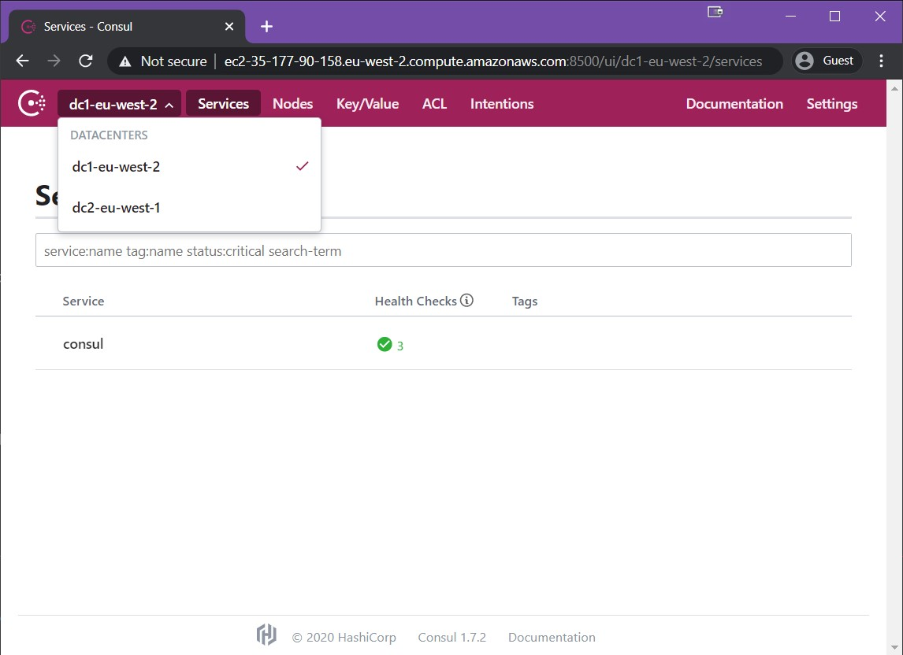

---

## Step 2 - Service Definitions and Health Checks

Now we want to add our services to Consul. for this we will need to create a Service Definition. 

Consul also allows the addition of Health Checks in the Service Definition. This gives us better visibility into our services.

#### MongoDB

The MongoDB service definition and Health check is the following:
```json
{
    "service": {
      "name": "mongodb",
      "port": 27017,
       "tags" : ["mongodb_no_connect"],
       "check": {
            "id": "mongodb_port",
            "name": "mongodb port listening",
            "tcp": "localhost:27017",
            "interval": "10s",
            "timeout": "1s"
        }
    }
  }

```

To save a bit of typing I've already loaded these templates into the /mnt/consul directory.


```bash
ubuntu@guy-consul-0663-wkr-0:~$ cd /mnt/consul/
ubuntu@guy-consul-0663-wkr-0:~$ sudo cp mongodb_noconnect.json.bkp mongodb.json
ubuntu@guy-consul-0663-wkr-0:~$ consul services register mongodb.json
Registered service: mongodb

```

Done. now we can check the Consul web UI again to see that our service is there:

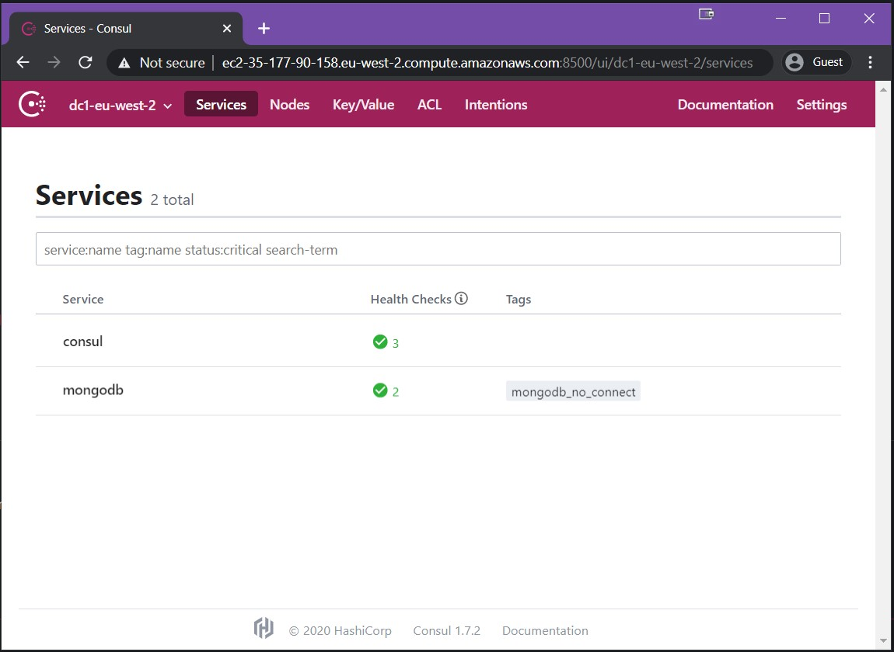

We can also click into this service and into the health check:
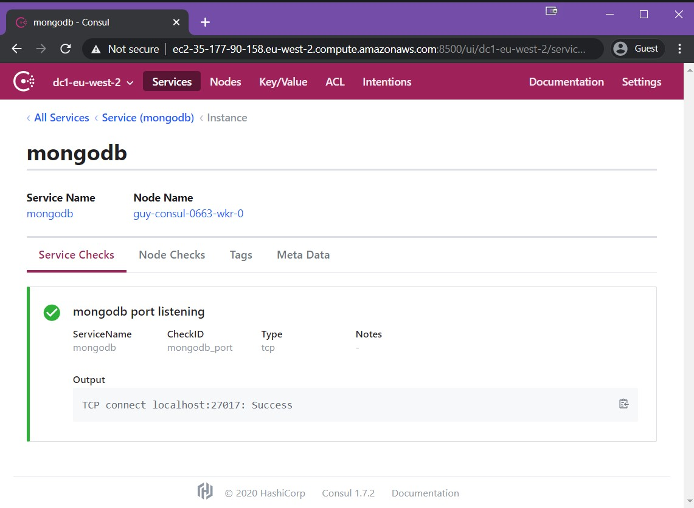

#### Chat

The Chat application service definition and Health check is the following:
```json
{
  "service": {
    "name": "chat",
    "port": 5000,
    "tags": [
      "chat_no_connect"
    ],
    "check": {
      "id": "chat_port",
      "name": "chat port listening",
      "tcp": "localhost:5000",
      "interval": "10s",
      "timeout": "1s"
    }
  }
}
```
SSH into a different worker node and set up the Chat Application
```bash
ubuntu@guy-consul-0663-wkr-1:~$ cd /mnt/consul
ubuntu@guy-consul-0663-wkr-1:/mnt/consul$ sudo cp chatapp_noconnect.json.bkp chat.json
ubuntu@guy-consul-0663-wkr-1:/mnt/consul$ consul services register chat.json
Registered service: chat
```

Now, if we look into the Consul Web UI, we can see that the service is there but its failing its health check.

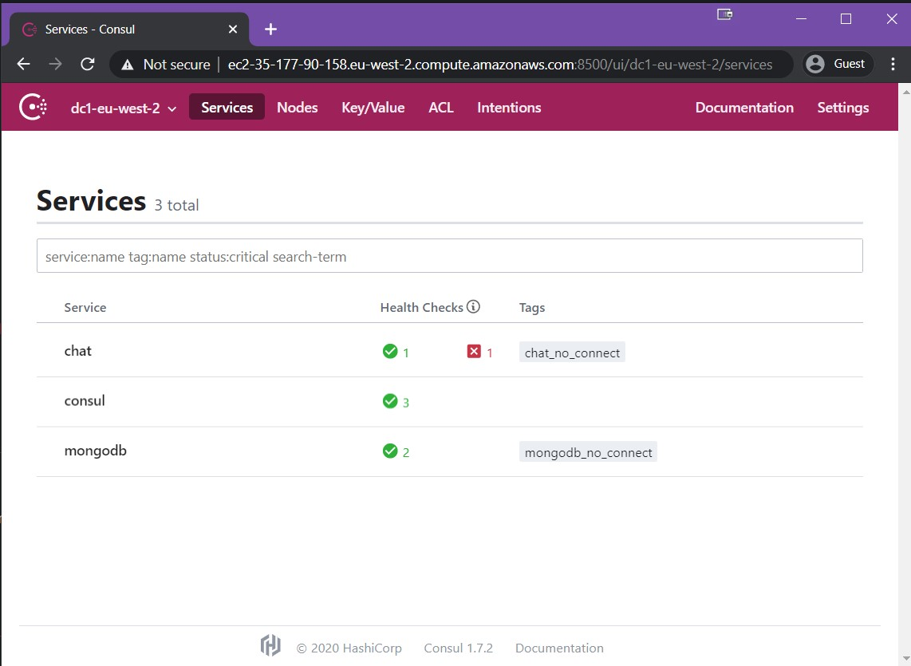

We can also click into this service and into the health check:
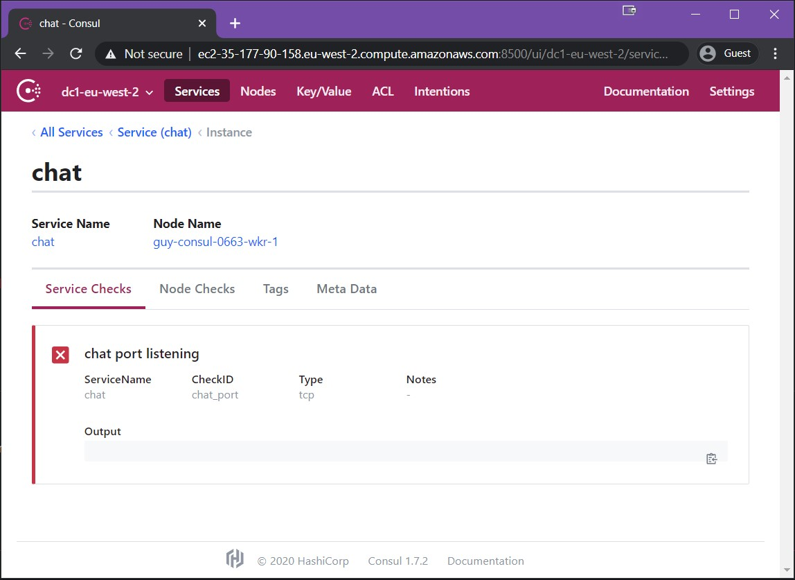


The service is failing because we aren't running the chat application yet.

 Now we will use the service discovery capabilities of Consul to help the chat application find the MongoDB instance using the DNS interface.
 
  For this we will change the "run.sh" script to use mongodb.service.consul instead of localhost for the MONGODB_SERVER env parameter:

```bash
ubuntu@guy-consul-0663-wkr-1:~$ cd /mnt/consul/chatapp/
ubuntu@guy-consul-0663-wkr-1:/mnt/consul/chatapp$ sudo sed -i 's/localhost/mongodb.service.consul/g' ./run.sh
ubuntu@guy-consul-0663-wkr-1:/mnt/consul/chatapp$ sudo nohup ./run.sh &

ubuntu@guy-consul-0663-wkr-1:/mnt/consul/chatapp$

```

If we check the Consul web ui again, the service will be healthy.

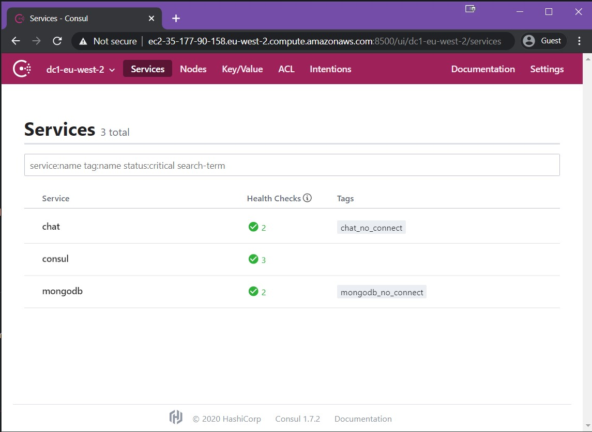


We can also now access the check application using port 5000 to see it working:

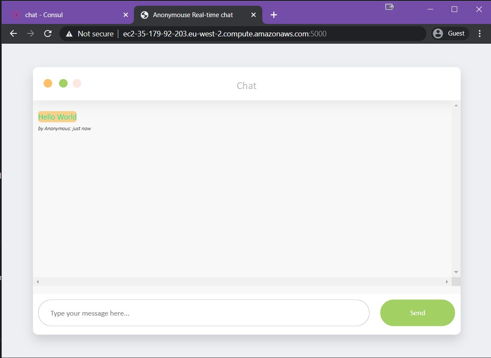


---

## Step 3 - Consul Connect Sidecar Proxies

Instead of using Consul to discover where Mongodb is running, we will use Consul to make this connection for us. 

We will need to amend the service definition for MongoDB and the Chatapp to use the new proxies and we will also need to start the proxies themselves in each of the machines. 

#### MongoDB

The MongoDB service definition and Health check is the following:

```json
{
    "service": {
      "name": "mongodb",
      "port": 27017,
      "tags" : ["mongodb_connect"],
       "check": {
            "id": "mongodb_port",
            "name": "mongodb port listening",
            "tcp": "localhost:27017",
            "interval": "10s",
            "timeout": "1s"
  },
      "connect": {
        "sidecar_service": { }
      }
    }
  }

```
To save a bit of typing I've already loaded these templates into the /mnt/consul directory.


```bash
ubuntu@guy-consul-0663-wkr-0:~$ cd /mnt/consul/
ubuntu@guy-consul-0663-wkr-0:~$ sudo cp mongodb_connect.json.bkp mongodb.json
ubuntu@guy-consul-0663-wkr-0:~$ consul services register mongodb.json
Registered service: mongodb

```

We can see a new service called mongodb-sidecar-proxy in the Consul web UI:

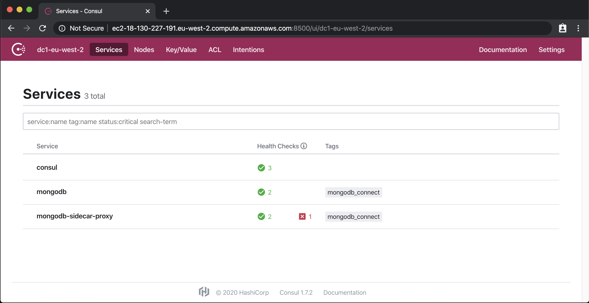

This service is failing because we haven't started the proxy itself yet.

To start this proxy we would need to run the *consul connect envoy -sidecar-for <SERVICE>* command, which again has been provided in ease to consume script form:

```bash
ubuntu@guy-consul-0663-wkr-0:~$ cd /mnt/consul/
ubuntu@guy-consul-0663-wkr-0:~$ sudo nohup ./run_mongodb_proxy.sh &
nohup: ignoring input and appending output to 'nohup.out'

ubuntu@guy-consul-0663-wkr-0:~$ 
```
This service is now healthy in the Consul Web UI


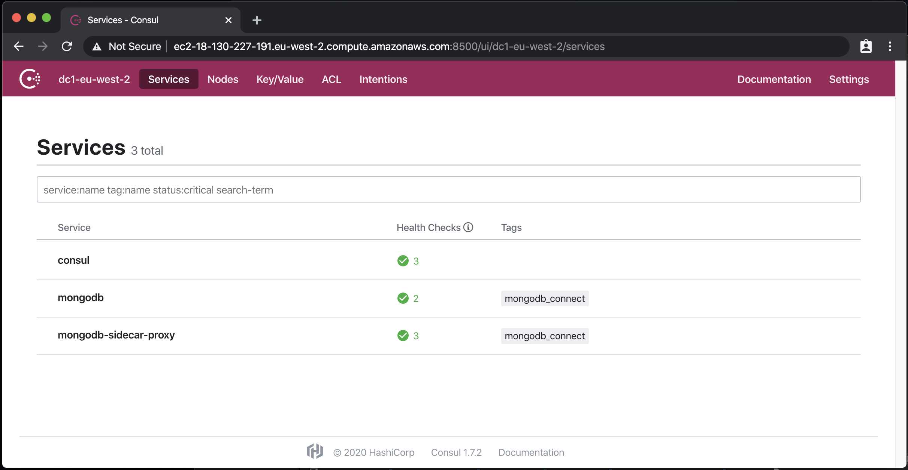


#### Chat

the Chat application service definition is a little bit different because we need to specify what upstream system we want to use consul connect to erm connect to.

To make our lives a bit easier, we will also specify which local port we want the consul connect envoy proxy to listen on.

```json
{
  "service": {
    "name": "chat",
    "port": 5000,
    "connect": {
      "sidecar_service": {
        "tags": [
          "chatapp-proxy"
        ],
        "proxy": {
          "upstreams": [
            {
              "destination_name": "mongodb",
              "local_bind_port": 8888
            }
          ]
        }
      }
    },
    "tags": [ "chat_with_connect"],
    "check": {
      "id": "chat_port",
      "name": "chat port listening",
      "tcp": "localhost:5000",
      "interval": "10s",
      "timeout": "1s"
    }
  }
}
```

Let's go ahead and apply these changes:

```bash
ubuntu@guy-consul-0663-wkr-1:~$ cd /mnt/consul
ubuntu@guy-consul-0663-wkr-1:/mnt/consul$ sudo cp chatapp_connect.json.bkp chat.json
ubuntu@guy-consul-0663-wkr-1:/mnt/consul$ consul services register chat.json
Registered service: chat
```

Start the envoy proxy as well:

```bash
ubuntu@guy-consul-0663-wkr-1:~$ cd /mnt/consul/
ubuntu@guy-consul-0663-wkr-1:~$ sudo nohup ./run_chatapp_proxy.sh &
nohup: ignoring input and appending output to 'nohup.out'

ubuntu@guy-consul-0663-wkr-1:~$ 
```

While both services are running, we aren't yet using the new proxy for the connection(when we started the chatapp, we set the Mongodb host to mongodb.service.consul).

We now have to restart the application to use the new consul connect proxy.

```bash
ubuntu@guy-consul-0663-wkr-1:~$ cd /mnt/consul/chatapp/
ubuntu@guy-consul-0663-wkr-1:~$ cd /mnt/consul/chatapp/ sudo pkill -9 "run.sh"
ubuntu@guy-consul-0663-wkr-1:~$ cd /mnt/consul/chatapp/ sudo pkill -9 "node"
ubuntu@guy-consul-0663-wkr-1:/mnt/consul/chatapp$ sudo sed -i 's/mongodb.service.consul/localhost/g' ./run.sh
ubuntu@guy-consul-0663-wkr-1:/mnt/consul/chatapp$ sudo sed -i 's/27017/8888/g' ./run.sh
ubuntu@guy-consul-0663-wkr-1:/mnt/consul/chatapp$ sudo nohup ./run.sh &

ubuntu@guy-consul-0663-wkr-1:/mnt/consul/chatapp$

```

Looking at the consul web ui, we should see all services running and healthy.

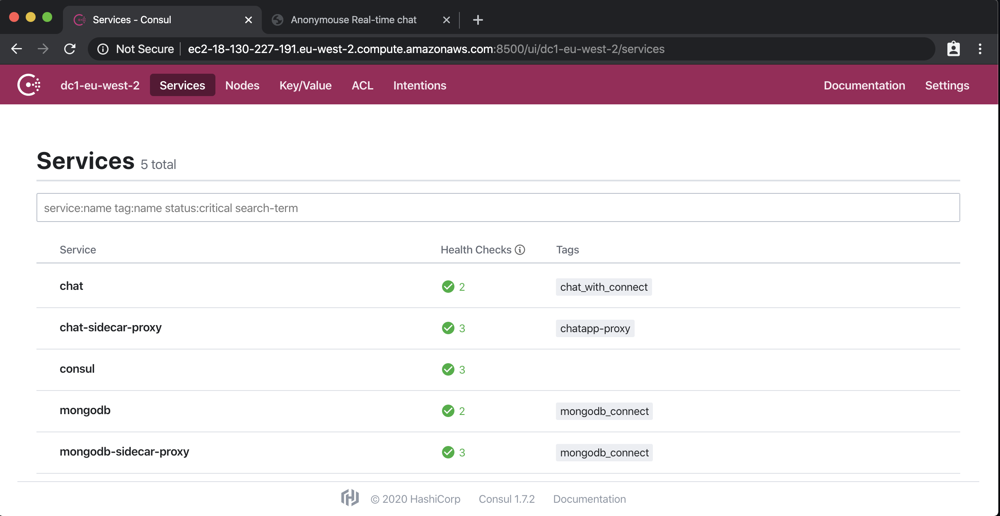

We are now ready to add another datacenter to the mix.


---
## Step 4 - Gateways and default service definitions

To make our services talk across federated datacenters, we will start a special type of service called a gateway to handle this connection. 

consul connect envoy  -mesh-gateway -register  -service "gateway" -address "$(private_ip):8700" -wan-address "$(public_ip):8700" -admin-bind "127.0.0.1:19007"

##### Datacenter 1

```bash
ssh -i ~/.ssh/id_rsa ubuntu@ec2-35-177-90-158.eu-west-2.compute.amazonaws.com
ubuntu@guy-consul-0663-svr-0:~$ cd /mnt/consul/
ubuntu@guy-consul-0663-svr-0:/mnt/consul/$   nohup ./run_gateway.sh &

```

In the Consul web ui, there is now a new service called gateway:

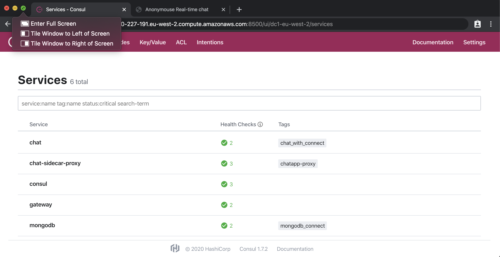

Add a default configuration that states that all services must use the gateway using the *consul config write* command. 

```json
{
    "Kind": "proxy-defaults",
    "Name": "global",
"MeshGateway" : {
  "mode" : "local"
}
}
```


```bash
ssh -i ~/.ssh/id_rsa ubuntu@ec2-35-177-90-158.eu-west-2.compute.amazonaws.com
ubuntu@guy-consul-0663-svr-0:~$ cd /mnt/consul/
ubuntu@guy-consul-0663-svr-0:/mnt/consul/$  consul config write proxy-defaults.json
ubuntu@guy-consul-0663-svr-0:/mnt/consul/$ 

```

Now we are ready to start configuring the Second Datacenter.
##### Datacenter 2

```bash
ssh -i ~/.ssh/id_rsa ubuntu@ec2-35-176-42-57.eu-west-2.compute.amazonaws.com
ubuntu@guy-consul-9b8f-svr-0:~$ cd /mnt/consul/
ubuntu@guy-consul-9b8f-svr-0:/mnt/consul/$   nohup ./run_gateway.sh &
ubuntu@guy-consul-9b8f-svr-0:/mnt/consul/$  consul config write proxy-defaults.json


```

In the second DC, there is only consul and gateway currently running

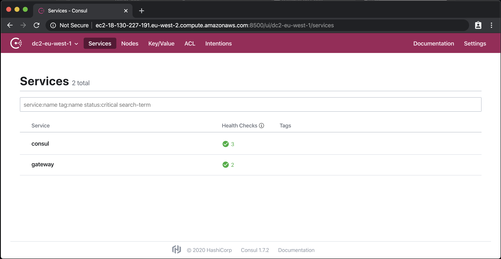


In the next section we will add the chatapp and a service router for MongoDB in DC2.

---
## Step 5 - Service Resolver

 Now it is time to start adding services to DC2. we will start by adding a Service router for MongoDB which will use the gateways to redirect any requests from the local DC to DC1.
 
 This makes it so we don't have to deploy MongoDB in Datacenter2 and the chatapp can just use the data from Datacenter1.

 ```hcl
kind = "service-resolver"
name = "mongodb"
redirect {
service    = "mongodb"
  datacenter = "dc1-eu-west-2"
}
 ```
Apply this and start the chatapp

```bash
ssh -i ~/.ssh/id_rsa ubuntu@ec2-3-10-235-228.eu-west-2.compute.amazonaws.com
ubuntu@guy-consul-9b8f-wkr-0:~$ cd /mnt/consul/
ubuntu@guy-consul-9b8f-wkr-0:/mnt/consul$ consul config write mongodb-resolver.hcl
ubuntu@guy-consul-9b8f-wkr-0:/mnt/consul$ sudo cp chatapp_connect.json.bkp chatapp.json
ubuntu@guy-consul-9b8f-wkr-0:/mnt/consul$ consul services register chatapp.json
ubuntu@guy-consul-9b8f-wkr-0:/mnt/consul$ sudo nohup ./run_chatapp_proxy.sh &
[1] 7702
ubuntu@guy-consul-9b8f-wkr-0:/mnt/consul$ nohup: ignoring input and appending output to 'nohup.out'
ubuntu@guy-consul-9b8f-wkr-0:/mnt/consul$ cd chatapp/
ubuntu@guy-consul-9b8f-wkr-0:/mnt/consul/chatapp$ sudo sed -i 's/mongodb.service.consul/localhost/g' ./run.sh
ubuntu@guy-consul-9b8f-wkr-0:/mnt/consul/chatapp$ sudo sed -i 's/27017/8888/g' ./run.sh
ubuntu@guy-consul-9b8f-wkr-0:/mnt/consul/chatapp$ sudo nohup ./run.sh &

```

When we check the Consul Web UI again, we can see the chatapp running correctly even without a mongodb service.

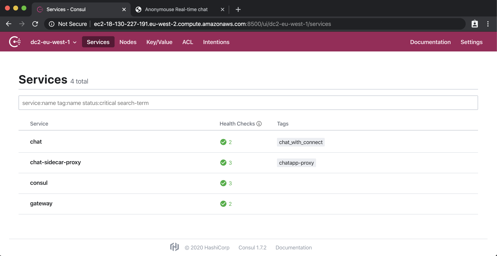

If we check the chatapp itself, we can see messages coming from Mongodb:

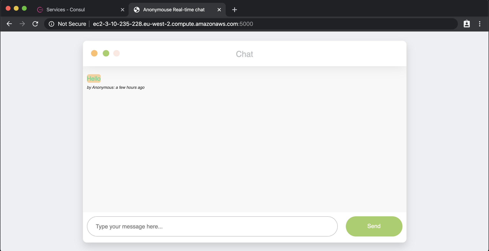

Done!

## Afterword

While this is a real simple and manual example, it does help to understand how consul abstracts the complexity of interconnecting multiple Datacenters and Services (aka Service Mesh).

The good thing about this example is that it can be used as a test environment and reapplied in different context.

To do this in a repeatable fashion, I would just use [Nomad](https://www.nomadproject.io/). since we can have native linux services and it can automatically create the sidecar proxies for you. (and it integrates nicely with Consul and Vault as well)

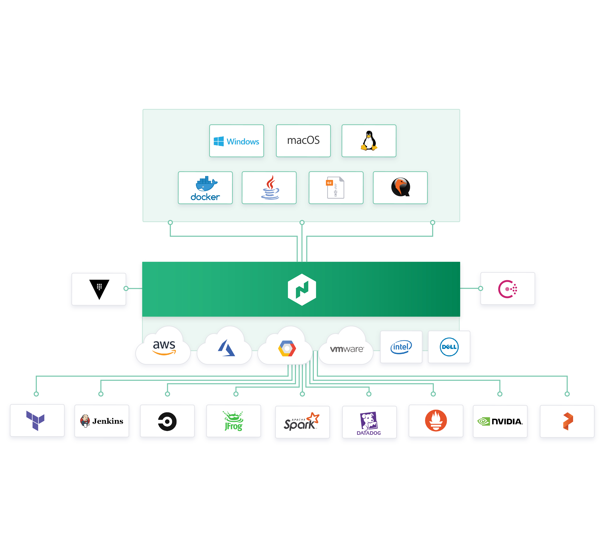


