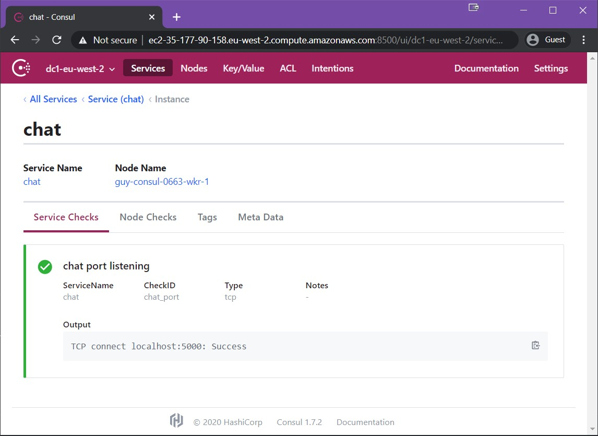

# 5 Steps to Service Mesh

This repository contains the terraform code that acompanies the session "5 Steps to Service Mesh".


## In a Nutshell
In a nutshell, these are the 5 steps that you need:


## included enviroment

in the [terraform/aws](./terraform/aws) directory there is code to spin up an environment with consul preconfigured. this takes a couple of minutes to get up and running correctly,

### Terraform Variables

```bash
# Module Configuration Variables
primary_region  = "eu-west-2"
secondary_region  = "eu-west-1"
owner   = "guybarros"
created-by = "Terraform CLI"
public_key = ""
clusterid = "guy-consul"
# host access IP needs to be your public IP to give you SSH Access host_access_ip = ["127.256.3.320/32"]
host_access_ip = []
server_number = "3"
server_instance_type = "t2.medium"
worker_number = "3"
worker_instance_type = "t2.medium"
primary_datacenter = "dc1"
secondary_datacenter = "dc2"
# General Variables
consul_url = "https://releases.hashicorp.com/consul/1.7.2/consul_1.7.2_linux_amd64.zip"
vpc_cidr_block = "10.1.0.0/16"
cidr_blocks = ["10.1.1.0/24", "10.1.2.0/24"]
consul_join = "consul_join"
```
### Terraform Outputs

the Terraform code outputs what you need to run this session, including the URL to access the Consul UI and a facilitator to ssh into each of the boxes.
```bash
Apply complete! Resources: 36 added, 0 changed, 0 destroyed.

Outputs:

Primary_Servers_SSH = [
  "ssh -i ~/.ssh/id_rsa ubuntu@ec2-35-177-90-158.eu-west-2.compute.amazonaws.com",
  "ssh -i ~/.ssh/id_rsa ubuntu@ec2-35-176-85-58.eu-west-2.compute.amazonaws.com",
  "ssh -i ~/.ssh/id_rsa ubuntu@ec2-3-8-158-168.eu-west-2.compute.amazonaws.com",
]
Primary_Servers_UI = [
  "http://ec2-35-177-90-158.eu-west-2.compute.amazonaws.com:8500",
  "http://ec2-35-176-85-58.eu-west-2.compute.amazonaws.com:8500",
  "http://ec2-3-8-158-168.eu-west-2.compute.amazonaws.com:8500",
]
Primary_Workers_SSH = [
  "ssh -i ~/.ssh/id_rsa ubuntu@ec2-35-176-252-166.eu-west-2.compute.amazonaws.com",
  "ssh -i ~/.ssh/id_rsa ubuntu@ec2-35-179-92-203.eu-west-2.compute.amazonaws.com",
  "ssh -i ~/.ssh/id_rsa ubuntu@ec2-3-8-148-74.eu-west-2.compute.amazonaws.com",
]
Primary_Workers_UI = [
  "http://ec2-35-176-252-166.eu-west-2.compute.amazonaws.com:8500",
  "http://ec2-35-179-92-203.eu-west-2.compute.amazonaws.com:8500",
  "http://ec2-3-8-148-74.eu-west-2.compute.amazonaws.com:8500",
]
Secondary_Servers_SSH = [
  "ssh -i ~/.ssh/id_rsa ubuntu@ec2-35-178-171-146.eu-west-2.compute.amazonaws.com",
  "ssh -i ~/.ssh/id_rsa ubuntu@ec2-3-10-51-236.eu-west-2.compute.amazonaws.com",
  "ssh -i ~/.ssh/id_rsa ubuntu@ec2-35-177-242-138.eu-west-2.compute.amazonaws.com",
]
Secondary_Servers_UI = [
  "http://ec2-35-178-171-146.eu-west-2.compute.amazonaws.com:8500",
  "http://ec2-3-10-51-236.eu-west-2.compute.amazonaws.com:8500",
  "http://ec2-35-177-242-138.eu-west-2.compute.amazonaws.com:8500",
]
Secondary_Workers_SSH = [
  "ssh -i ~/.ssh/id_rsa ubuntu@ec2-3-8-77-88.eu-west-2.compute.amazonaws.com",
  "ssh -i ~/.ssh/id_rsa ubuntu@ec2-35-176-178-215.eu-west-2.compute.amazonaws.com",
  "ssh -i ~/.ssh/id_rsa ubuntu@ec2-18-130-84-185.eu-west-2.compute.amazonaws.com",
]
Secondary_Workers_UI = [
  "http://ec2-3-8-77-88.eu-west-2.compute.amazonaws.com:8500",
  "http://ec2-35-176-178-215.eu-west-2.compute.amazonaws.com:8500",
  "http://ec2-18-130-84-185.eu-west-2.compute.amazonaws.com:8500",
]
```

---

## Running the demo

### Pre requisites

there is a little bit of a set up that we need to be able to run this demo. namely, start mongodb and start the Chat application.

#### MongoDB

ssh into any Primary Worker node, Install, Configure and Run Mongodb

```bash

ssh -i ~/.ssh/id_rsa ubuntu@ec2-35-176-252-166.eu-west-2.compute.amazonaws.com

ubuntu@guy-consul-0663-wkr-0:~$ sudo apt install mongodb-server

ubuntu@guy-consul-0663-wkr-0:~$ sudo sed -i 's/127.0.0.1/0.0.0.0/g' /etc/mongodb.conf

ubuntu@guy-consul-0663-wkr-0:~$ sudo systemctl restart mongodb

```
thats it. we'll set up the Chatt application after we configure MongoDB in Consul so we can use the Service Discovery features of Consul.

---

## Step 1 - Consul Clusters

The set up for the consul cluster itself and ensuring that every node already has a Consul agent is done by the terraform code. you can look at the start up scripts that do this [here](./terraform/aws/modules/templates).

we do however need to federate DC2 to DC1. to do this, ssh into any Server node and run the following command:


##### Mongodb.consul:
```bash
ssh -i ~/.ssh/id_rsa ubuntu@ec2-35-177-90-158.eu-west-2.compute.amazonaws.com
ubuntu@guy-consul-0663-svr-0:~$ consul join -wan <ANY_SECONDARY_SERVER_ADDRESS>
Successfully joined cluster by contacting 1 nodes.
ubuntu@guy-consul-0663-svr-0:~$ consul members -wan list
Node                                 Address              Status  Type    Build  Protocol  DC             Segment
guy-consul-0663-svr-0.dc1-eu-west-2  35.177.90.158:8302   alive   server  1.7.2  2         dc1-eu-west-2  <all>
guy-consul-0663-svr-1.dc1-eu-west-2  35.176.85.58:8302    alive   server  1.7.2  2         dc1-eu-west-2  <all>
guy-consul-0663-svr-2.dc1-eu-west-2  3.8.158.168:8302     alive   server  1.7.2  2         dc1-eu-west-2  <all>
guy-consul-5645-svr-0.dc2-eu-west-1  35.178.171.146:8302  alive   server  1.7.2  2         dc2-eu-west-1  <all>
guy-consul-5645-svr-1.dc2-eu-west-1  3.10.51.236:8302     alive   server  1.7.2  2         dc2-eu-west-1  <all>
guy-consul-5645-svr-2.dc2-eu-west-1  35.177.242.138:8302  alive   server  1.7.2  2         dc2-eu-west-1  <all>


```
done, now we can go to the Consul UI and check that both DCs are available from the drop down:


---

## Step 2 - Service Definitions and Health Checks

now we wnat to add our services to Consul. for this we will need to create a Service Definition. Consul also allows the adition of Health Checks in the Service Definition. this gives us better visibility into our services.

#### MongoDB

the MongoDB service defintion and Health check is the following:
```json
{
    "service": {
      "name": "mongodb",
      "port": 27017,
       "tags" : ["mongodb_no_connect"],
       "check": {
            "id": "mongodb_port",
            "name": "mongodb port listening",
            "tcp": "localhost:27017",
            "interval": "10s",
            "timeout": "1s"
        }
    }
  }

```

to save a bit of typing I've already loaded these templates into the /mnt/consul directory.


```bash
ubuntu@guy-consul-0663-wkr-0:~$ cd /mnt/consul/
ubuntu@guy-consul-0663-wkr-0:~$ sudo cp mongodb_noconnect.json.bkp mongodb.json
ubuntu@guy-consul-0663-wkr-0:~$ consul services register mongodb.json
Registered service: mongodb

```

done. now we can check the Consul web UI again to see that our service is there:


we can also click into this service and into the health check:


#### Chat

the Chat application service defintion and Health check is the following:
```json
{
  "service": {
    "name": "chat",
    "port": 5000,
    "tags": [
      "chat_no_connect"
    ],
    "check": {
      "id": "chat_port",
      "name": "chat port listening",
      "tcp": "localhost:5000",
      "interval": "10s",
      "timeout": "1s"
    }
  }
}
```
SSH into a different worker node and set up the Chat Application
```bash
ubuntu@guy-consul-0663-wkr-1:~$ cd /mnt/consul
ubuntu@guy-consul-0663-wkr-1:/mnt/consul$ sudo cp chatapp_noconnect.json.bkp chat.json
ubuntu@guy-consul-0663-wkr-1:/mnt/consul$ consul services register chat.json
Registered service: chat
```

Now, if we look into the Consul Web UI, we can see that the service is there but its failing its healthcheck.


we can also click into this service and into the health check:


the service is failing because we arent running the chat application yet. Now we will use the service discovery capabilities of Consul to help the chat application find the MongoDB instance using the DNS interface. for this we will change the "run.sh" script to use mongodb.service.consul instead of localhost for the MONGODB_SERVER env parameter

```bash
ubuntu@guy-consul-0663-wkr-1:~$ cd /mnt/consul/chatapp/
ubuntu@guy-consul-0663-wkr-1:/mnt/consul/chatapp$ sudo sed -i 's/localhost/mongodb.service.consul/g' ./run.sh
ubuntu@guy-consul-0663-wkr-1:/mnt/consul/chatapp$ sudo nohup ./run.sh &

ubuntu@guy-consul-0663-wkr-1:/mnt/consul/chatapp$

```

now, if we check the Consul web ui again, the service will be healthy.




we can also now access the check application using port 5000 to see it working:


---

## Step 3 - Consul Connect Sidecar Proxies


---
## Step 4 - Gateways and default service definitions


---
## Step 4 - Service Routers


---


